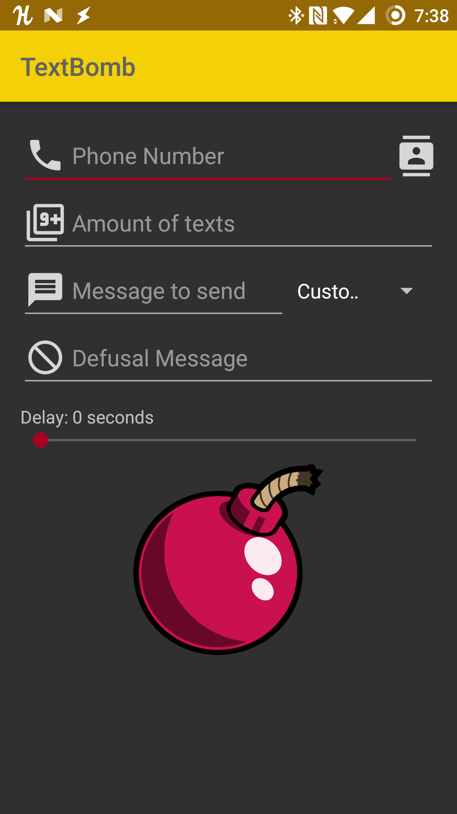

# TextBomb
Simple android app that allows you to TextBomb (send multiple messages) to your friends with at the touch of a button 

  

# Features
* Time delay - Send a message every one second or every hour, the choice is yours
* Custom messages - Either type up your own message to send, or choose from one of the many animal facts included
* Defusal message - Allow your friend to cancel the incoming textbomb by replying with the code word(s) of your choice.

